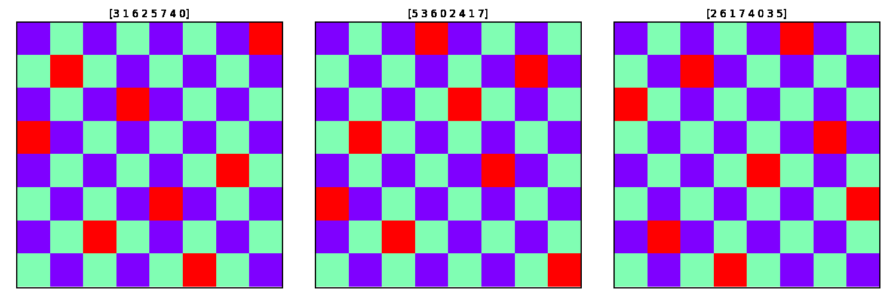

# Genetic Algorithm
"A genetic algorithm (GA) is a metaheuristic inspired by the process of natural selection that belongs to the larger class of evolutionary algorithms (EA)". You can find an implementation of the algorithm in the source file `genetic.py` as a Python class. The provided class supports:

* Fitness-based and Tournament Selection Methods,
* Single-point and Uniform Crossovers,
* Bit-flip, Swap, and Scramble Mutation Operators, 
* Fitness-based Survivor Selection Method, and
* Elitisim.

The algorithm can be configured to terminate when:

* A certain number of epochs has passed.
* A certain number of epochs has passed and no improvement has been observed (early stop).
* The fitness value of the population has surpassed a specific threshold.

By running the source file `n-queens.py` the algorithm will attemp to solve the [N-Queens Problem](https://en.wikipedia.org/wiki/Eight_queens_puzzle). The file `utils.py` contains a function for initializing the population and another one to plot the final board. The following are some of results for `n=8` after just a handful of epochs!

    

*The `utils.py` file contains another initializer for problems with binary chromosomes. But fill free to use any initializer you like :) Just make sure the output is in the shape `[population_size, chromosome_size]`.*
